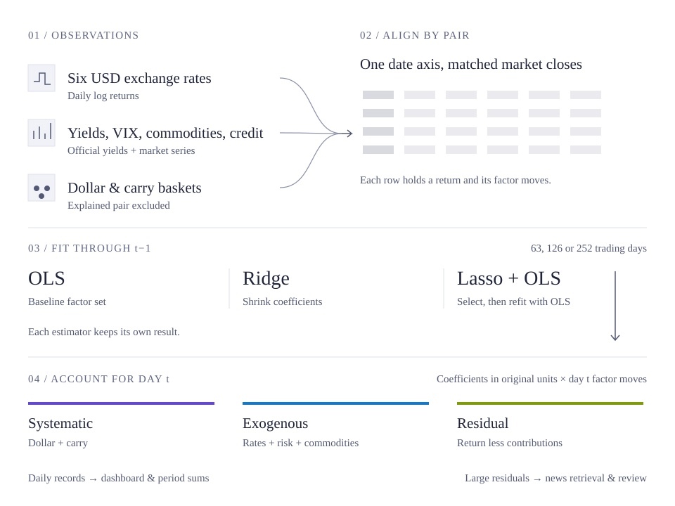
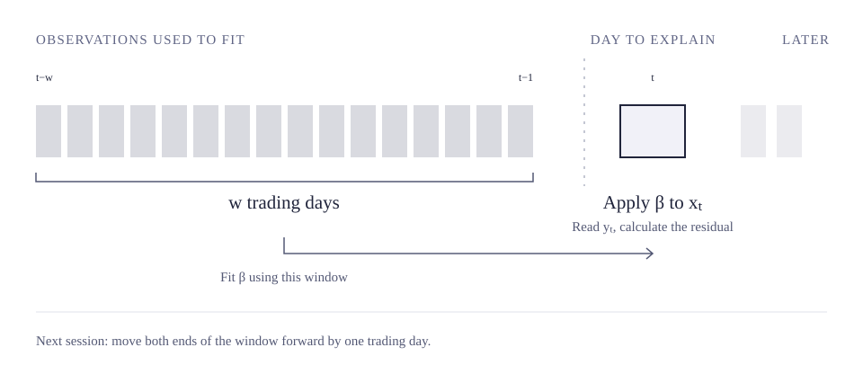

# FX Factor Attribution Dashboard

Daily factor attribution for USD/EUR, USD/JPY, USD/CAD, USD/NOK, USD/AUD and
USD/MXN. The dashboard shows how each currency's move relates to dollar and carry
factors, interest rates, volatility, commodities and credit. The part left over is
reported as a residual, with a news note when it is unusually large.

[Open the dashboard](https://patrickliu77.github.io/fx-factor-attribution/)
or read the [methodology](https://patrickliu77.github.io/fx-factor-attribution/#/methodology).
The public site updates each evening and shows when its data and headlines were
collected. It covers completed trading days.

## How it works



All quotes use USD/XXX, so a positive return means dollar strength. Daily returns
are logarithmic. Each factor contribution is its move on day `t` multiplied by a
coefficient estimated through `t-1`:

```text
contribution[i, t] = beta[i, t] * factor_move[i, t]
residual[t] = FX_return[t] - sum(contributions[t])
```

The FX page groups the result into systematic contributions (dollar and carry),
exogenous contributions (the remaining factors), and the residual. The Attribution
page separates the exogenous group into rates, risk and commodities. Period views
add the daily records over the last 1, 5 or 21 trading observations.

The coefficients use rolling windows of 63, 126 and 252 trading observations.
OLS at 126 days supplies the FX page and news trigger; the Attribution page lets
readers compare windows, estimators and return periods. Open a currency pair from
either page to see its individual daily contributions, coefficient history,
training R² and residual z scores. Lasso includes a factor selection history.
The public research view shows the latest 252 trading observations.



| Estimator | Calculation |
|---|---|
| OLS | Fits the baseline factor set |
| Ridge | Fits the same set with coefficient shrinkage |
| Lasso + OLS | Selects from a wider menu, then fits OLS on the retained columns |

Factors are standardised inside the training window. Final coefficients are
converted back to their original units for attribution. Ridge and Lasso choose
their penalties using three forward time series splits, reselecting every 21
trading observations. Within each split, means and scales are learned from the
training fold alone and applied unchanged to its validation fold. Each estimator
keeps its own result.

An agreement badge compares the three contribution groups across estimators,
scaled by the pair's recent residual size. Rolling PCA and model health checks
provide further context on common currency structure and changes in fit.

The current calculation revision is `2026-09-04.fold-local-cv-pca`. It corrects
validation-fold preprocessing and applies correlation-PCA loadings to standardised
returns. Contract and PCA files carry version `1.1.1`; their fields are unchanged.

These are statistical return decompositions. A contribution describes the fitted
association with an observed factor move; it does not establish an event's causal
effect. Percentages on the FX cards use the sum of absolute group contributions
as their denominator. Signed bp values show the direction and possible offsets.

## Factors and sources

The common core is a dollar factor, a carry factor, short and long US minus foreign
yield differential changes, and the daily change in VIX. Dollar and carry exclude
the currency pair being explained. Dollar averages available returns from the other
five pairs. Carry uses fixed low yield (JPY, EUR) and high yield (MXN, AUD) groups.

| Pair | Additional baseline factors | Foreign yield source |
|---|---|---|
| USD/EUR | Common core only | Deutsche Bundesbank |
| USD/JPY | Gold | Japan Ministry of Finance |
| USD/CAD | WTI crude | Bank of Canada Valet |
| USD/NOK | Brent crude | Norges Bank |
| USD/AUD | Copper, gold | Reserve Bank of Australia F2 |
| USD/MXN | EMB return | Banxico SIE |

Lasso also considers `HY_EXCESS` (HYG less IEI log returns) and `dHY_OAS`
(the change in the US high yield spread). AUD adds only `HY_EXCESS`. Each pair
has at most eight candidates.

Yahoo Finance supplies prices and ETF data; FRED supplies US yields, VIX and credit
spreads. Foreign yields use the official sources above, with US maturities matched
to each leg. The data are aligned by effective market close using fixed offsets
for each pair.

Downloads fall back to the last successful cache, then a supplied local file.
The latest panel row and rows awaiting delayed releases are marked provisional.
Daily runs can replace those rows when source dates advance and retain an audit
of the changes. Completed history stays frozen during regular runs.

## News notes

The narrative layer starts when both `|residual_z| >= 2` and
`|residual| >= 50 bp`, with at most three pairs selected on a date. Google News
RSS supplies dated reporting. Gemini receives that reporting, daily model facts,
recent context and any previous note for the pair, then writes an English and
Chinese commentary.

Six checks cover sources, dates, numeric strings, causal claims, directional
forecasts and matching citations across languages. Drafts that fail are retained
for review. Mechanical checks have limits, so the source links remain available
alongside each published note. The residual is reported for its currency and date;
an individual headline's contribution is unmeasured.

Existing notes keep the facts saved when they were generated. A later history
recalculation can change dashboard values without rewriting those dated notes.

Daily headlines are fetched independently of the narrative trigger. The public
site includes the headlines collected at build time.

## Running locally

Install the Python packages listed in the public repository:

```powershell
python -m pip install -r requirements.txt
```

Set the credentials for the data services and narrative generation:

```powershell
setx FRED_API_KEY <key>
setx BANXICO_TOKEN <token>
setx GEMINI_API_KEY <key>
```

Gemini is used by the narrative command. Open a new terminal after `setx`.
Historical runs also need `data/user/fred_BAMLH0A0HYM2.csv`, the archived high yield
spread series used to extend FRED's available history. Input files and generated
outputs are excluded from this public repository.

```powershell
$env:PYTHONPATH = "src"

python -m fxdash.run --mode backfill --start 2010-01-01
python -m fxdash.run --mode live
python -m fxdash.narrative.run
powershell -ExecutionPolicy Bypass -File ops\serve.ps1
```

The local service opens at `http://127.0.0.1:8321`. It reads saved outputs into an
in memory snapshot and reloads when the nightly result arrives. Static HTML
reports are written to `outputs/reports/`. The public site is built from the same
frontend and selected API responses.

## Working on the project

The Python package lives in `src/fxdash/`: `data/` handles acquisition and
alignment, `factors/` builds the panels, `models/` fits the estimators, and
`attribution/` writes the daily contract. `schedule/` merges runs;
`narrative/`, `web/` and `report/` consume the saved results.

Run the offline suite with `python -m pytest`. Scheduling, history rewrite flags
and publishing are documented in [ops/README.md](ops/README.md).

The Methodology illustrations are original SVGs. Their shared drawing source is
[`methodology-figures.js`](src/fxdash/web/static/methodology-figures.js); regenerate
the standalone files with `node ops/render_methodology_figures.mjs` after an edit.
The page and illustrations use Outfit for text and IBM Plex Mono for numeric
labels. Font files are served locally and embedded in the SVG exports, so the
README images keep the same typefaces. Chinese text uses the same system font
fallbacks as the website. Font sources and licenses are in
[`static/fonts/`](src/fxdash/web/static/fonts/README.md).
